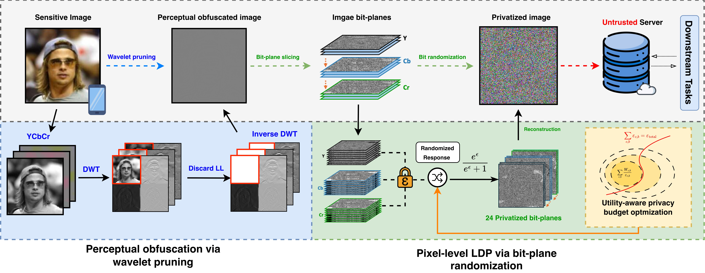
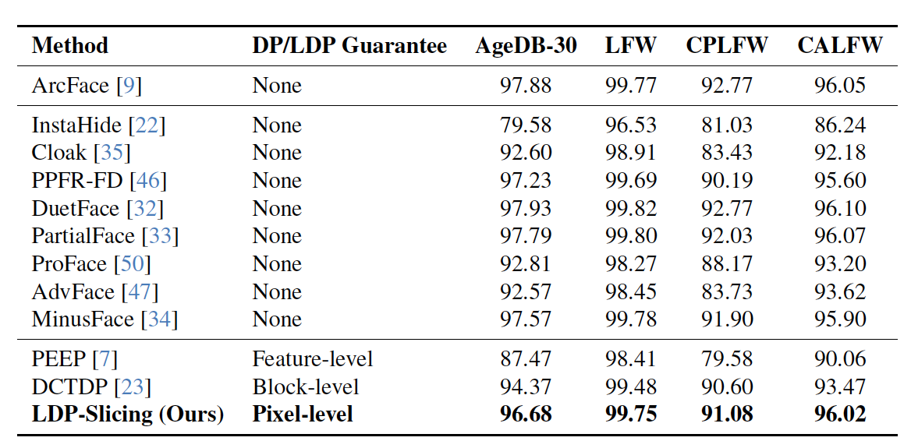
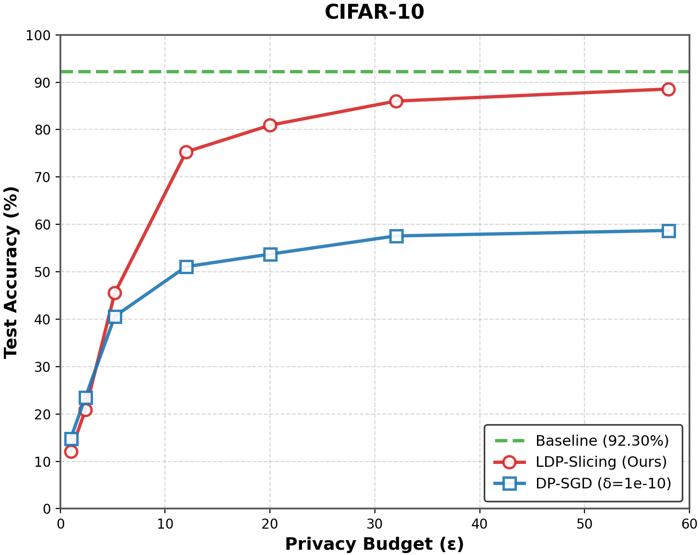
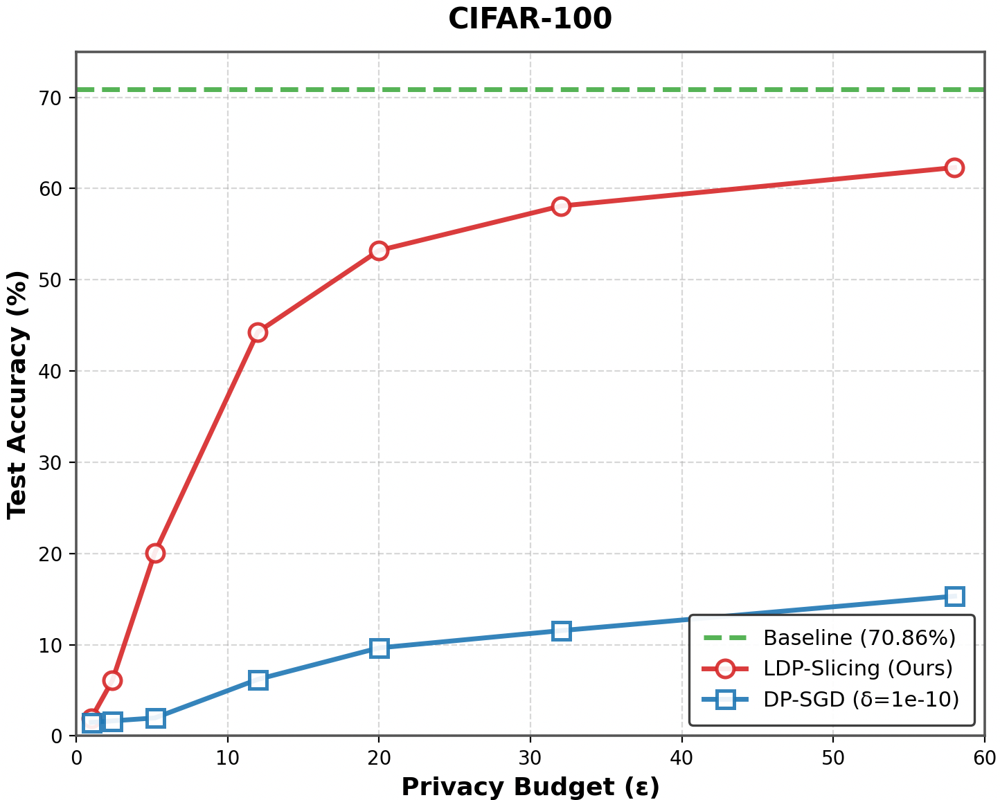

# LDP-Slicing: Local Differential Privacy for Images via Randomized Bit-Plane Slicing

<p align="center">
    <a href="https://scholar.google.com/citations?user=oMFszPAAAAAJ&hl=en">Yuanming Cao</a> ·
    <a href="https://scholar.google.com/citations?user=lvzvu-cAAAAJ&hl=zh-CN">Chengqi Li</a> ·
    <a href="https://www.cas.mcmaster.ca/~hew11/">Wenbo He</a>
</p>
<p align="center">
    <b>CVPR 2026</b><br/>
    <a href="xxx">Paper</a> · <a href="https://github.com/HideTheDandi/LDP-Slicing">Code</a>
</p>


---

## TL;DR
- We propose **LDP-Slicing**, a training-free image privatization pipeline with pixel-level local differential privacy.
- We apply randomized response in a **bit-plane representation** and combine it with optional perceptual obfuscation.

## Overview

> Local Differential Privacy (LDP) is a strong trust model but is often considered impractical for images due to high-dimensional pixel space. LDP-Slicing addresses this mismatch by converting pixels to bit planes and applying LDP directly at bit level, with perceptual obfuscation (DWT-based) and optimized privacy budget allocation.



## Environment

```bash
pip install -r requirements.txt
```

## Quick Start 

### 1) Load epsilon allocation from table
```python
from ldp_slicing import get_epsilon_value

epsilon_y, epsilon_c = get_epsilon_value(20.0)
```

### 2) Apply privatization
```python
import torch
from ldp_slicing import dp_slicing_dwt

device = "cuda" if torch.cuda.is_available() else "cpu"
x = torch.rand(1, 3, 224, 224, device=device)  # [0,1]

x_priv = dp_slicing_dwt(
        x,
        wavelet="haar",
        level=1,
        remove_ll=True,
        ll_scale=0.0,
        epsilon_y=epsilon_y,
        epsilon_c=epsilon_c,
        device=device,
)
```

## Privacy Budget Table

The precomputed budget schedules are provided in `privacy_budgets.json` for total budgets (Full derivation is in Appendix of the main paper): 

```
1.0, 2.4, 5.2, 12.0, 20.0, 32.0, 58.0
```

Each entry contains:
- `epsilon_y`: 8-value tuple for Y channel bit-planes
- `epsilon_c`: 8-value tuple for Cb/Cr channel bit-planes

## Main Results

### Privacy-preserving face recognition:


### Privacy-preserving image classification:

 

## Citation
If you find this project useful, please cite:

```bibtex
@inproceedings{cao2026ldpslicing,
    title={LDP-Slicing: Local Differential Privacy for Images via Randomized Bit-Plane Slicing},
    author={Yuanming Cao and Chengqi Li and Wenbo He},
    booktitle={Proceedings of the IEEE/CVF Conference on Computer Vision and Pattern Recognition},
    year={2026}
}
```

## License
**Apache License 2.0**.
- Full details: [`LICENSE.txt`](LICENSE.txt)
